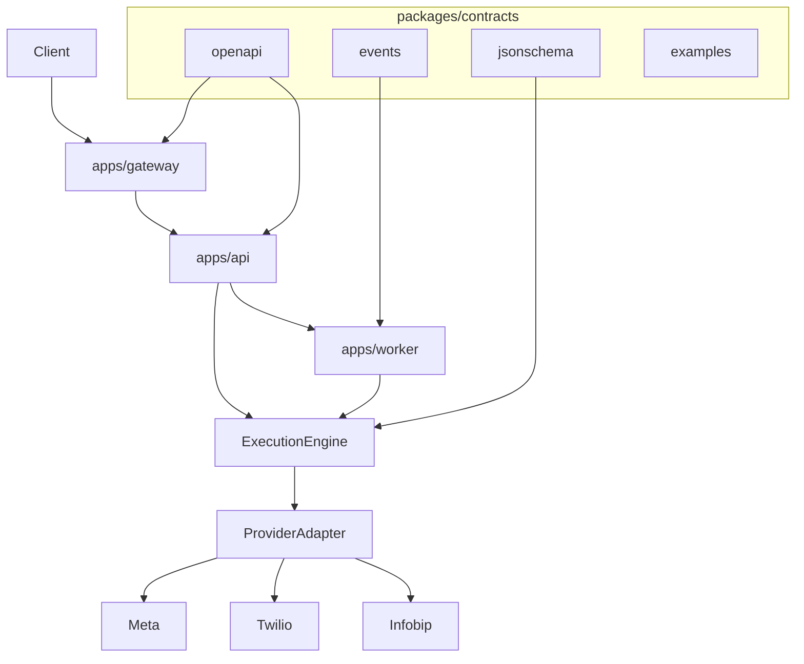

# OmniMsg North Star

Central reference for vision, architecture, scope, and implementation status.

**Product:** [omnimsg.io](https://omnimsg.io)  
**Company:** [FinestAR](https://finestar.hr/)

## Vision

OmniMsg is an **API-first omnichannel messaging platform**.

> **One API. Any channel. Any provider.**

Customers integrate once with a stable HTTP API. The platform routes messages across channels (WhatsApp, SMS, email, RCS, push) and providers (Meta, Twilio, Infobip, and others) without requiring client-side changes when vendors or routes change.

### Tech Provider go-to-market

v1 focuses on becoming a [Meta WhatsApp Tech Provider](https://developers.facebook.com/documentation/business-messaging/whatsapp/solution-providers/get-started-for-tech-providers) — not a Solution Partner reseller. That path enables Embedded Signup, webhook ingress, and multi-tenant WABA messaging on behalf of client businesses.

Embedded Signup UI, Meta App Review / business verification, and production webhook verification are **future deliverables** of the **api** and **channels** phases. They are not implemented in foundation.

Primary channel path: WhatsApp via Meta Cloud API (ADR-0017). Stack: ADR-0016.

## Architecture

OmniMsg is **not** a direct `API → Provider` integration. Requests flow through explicit layers so the public interface stays stable while providers evolve.

```text
Client
  ↓
apps/gateway     (edge: auth, rate limits, routing, webhook ingress)
  ↓
apps/api         (business logic, stable public interface)
  ↓
Execution Engine (orchestration, routing, retries, state)
  ↓
Provider Adapter (channel abstraction in packages/providers/)
  ↓
Vendor           (Meta / Twilio / Infobip / ...)
```

Async work (delivery, retries, webhook processing) is handled by `apps/worker` using event contracts in `packages/contracts/events/`.



### Architectural Goals

| Goal | Description |
|------|-------------|
| Contract First | OpenAPI, events, and JSON Schema in `packages/contracts/` are the source of truth (ADR-0005). |
| Execution Engine | Orchestration, routing, retries, and state live between API and adapters (ADR-0004). |
| Provider Abstraction | Channel packages under `packages/providers/` hide vendor specifics. |
| Event-Driven | Workers and webhooks use versioned event contracts (ADR-0006). |
| Observability | Metrics, tracing, logging from day one (ADR-0011). |
| Multi-Tenant | Tenant isolation on keys, data, and configuration (ADR-0007). |

## Roadmap

| Phase | Focus |
|-------|--------|
| **foundation** | Repository skeleton, ADRs, contracts layout, stack selection, local dev tooling |
| **api** | Gateway auth, `/v1/` API skeleton, execution engine core, uniform errors; Meta Embedded Signup / App Review prep |
| **channels** | WhatsApp provider adapter, Meta webhook verification → execution engine, delivery events, additional channels |
| **portal** | Customer portal consuming the public API |

## v1 Scope

v1 delivers a working platform skeleton and first vertical slice:

- API skeleton with versioned public interface (`/v1/`)
- Gateway authentication and rate limiting at the edge
- Execution engine core with provider adapter interface
- WhatsApp provider adapter via Meta Cloud API (Tech Provider path; ADR-0017)
- Inbound and outbound webhooks (Meta ingress via gateway)
- Multi-tenant API keys and per-tenant provider / WABA configuration
- Contract-first OpenAPI and event layout (schemas populated incrementally)
- Observability hooks (structured logging, trace context)

## Not v1

The following are explicitly out of v1 scope:

- Portal UI (`apps/portal/`)
- Full channel coverage (SMS, email, RCS, push production adapters)
- SDK generation and published SDK packages
- Kubernetes production deployment
- Advanced failover across multiple vendors per channel
- Full OAuth portal authentication
- Meta Solution Partner reseller model

## Implementation Status

| Component | Status | Notes |
|-----------|--------|-------|
| Repository skeleton | Done | Apps, packages, infrastructure, docs layout |
| ADRs (0001–0017) | Done | Includes stack (0016) and Meta Tech Provider path (0017) |
| Product positioning | Done | omnimsg.io, FinestAR, Tech Provider GTM |
| NORTH_STAR | Done | This document |
| OpenAPI contracts | Done | `/v1/health`, `/v1/messages`, `GET /v1/messages/{id}`, Bearer security |
| Event contracts | Done | `message.queued.v1`, `message.delivery_updated.v1`, `webhook.inbound.received.v1` |
| apps/gateway | Done | Bearer API-key auth, Redis rate limit, proxy + public `/health` |
| apps/api | Done | Persist + idempotency, internal auth resolve, ADR-0015 validation |
| Schema / migrations | Done | Alembic: `tenants`, `api_keys`, `messages`; local seed script |
| Execution Engine | In progress | Worker stub status + delivery events; provider ABC/stub |
| apps/worker | Done | Dequeue → stub provider → status update → delivery event |
| packages/providers/whatsapp | Not started | First real channel adapter (Meta Cloud API) — channels phase |
| packages/providers/sms, email, rcs, push | Not started | Future channels |
| packages/sdk-* | Not started | Post-OpenAPI stabilization |
| apps/portal | Not started | Post-API maturity |
| Docker Compose (local dev) | Done | App-only Compose on shared Traefik / Postgres / Redis |
| infrastructure/observability | Not started | Metrics, tracing, dashboards |
| CI workflows | Done | Ruff, migrations, Postgres/Redis pytest, OpenAPI presence |
| Meta Embedded Signup / App Review | Not started | api / channels phases |

## Related Documents

- [README](../README.md) — project overview
- [docs/adr/](adr/) — architecture decision records (index + template)
- [docs/rfcs/](rfcs/) — proposed changes not yet accepted
- [CONTRIBUTING.md](../CONTRIBUTING.md) — contribution guidelines
