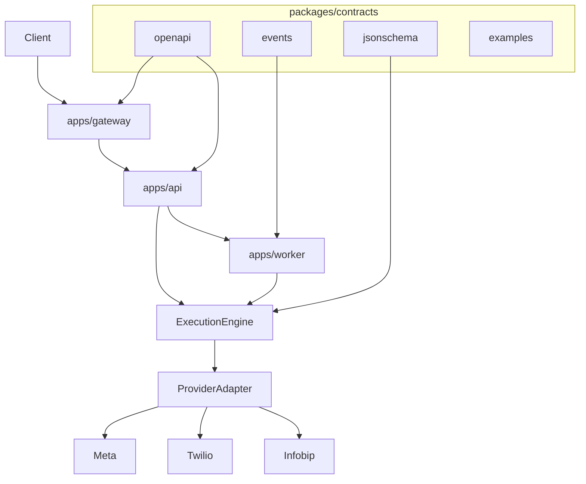

# OmniMsg North Star

Central reference for vision, architecture, scope, and implementation status.

**Product:** [omnimsg.io](https://omnimsg.io)  
**Company:** [FinestAR](https://finestar.hr/)

## Vision

OmniMsg is an **API-first omnichannel messaging platform**.

> **One API. Any channel. Any provider.**

Customers integrate once with a stable HTTP API. The platform routes messages across channels (WhatsApp, SMS, email, RCS, push) and providers (Meta, Twilio, Infobip, and others) without requiring client-side changes when vendors or routes change.

### Solution Partner go-to-market

v1 focuses on becoming a [Meta WhatsApp Solution Partner](https://developers.facebook.com/documentation/business-messaging/whatsapp/solution-providers/get-started-for-solution-partners): OmniMsg holds a Meta **credit line**, clients do not enter a Meta payment method, and **FinestAR invoices** WhatsApp usage plus platform fees. That path enables Embedded Signup, webhook ingress, multi-tenant WABA messaging, and credit-line sharing to onboarded client businesses.

Embedded Signup UI, Meta App Review (Advanced access), credit-line ops, and production webhook verification are **future deliverables** of the **api** and **channels** phases (billing engine later). They are not implemented in foundation. Ops checklist: [Meta WhatsApp Solution Partner runbook](providers/meta-whatsapp-solution-partner.md).

Primary channel path: WhatsApp via Meta Cloud API (ADR-0018; supersedes ADR-0017). Stack: ADR-0016.

## Architecture

OmniMsg is **not** a direct `API → Provider` integration. Requests flow through explicit layers so the public interface stays stable while providers evolve.

```text
Client
  ↓
apps/gateway     (edge: auth, rate limits, routing, webhook ingress)
  ↓
apps/api         (business logic, stable public interface)
  ↓
Execution Engine (orchestration, routing, retries, state)
  ↓
Provider Adapter (channel abstraction in packages/providers/)
  ↓
Vendor           (Meta / Twilio / Infobip / ...)
```

Async work (delivery, retries, webhook processing) is handled by `apps/worker` using event contracts in `packages/contracts/events/`.



### Architectural Goals

| Goal | Description |
|------|-------------|
| Contract First | OpenAPI, events, and JSON Schema in `packages/contracts/` are the source of truth (ADR-0005). |
| Execution Engine | Orchestration, routing, retries, and state live between API and adapters (ADR-0004). |
| Provider Abstraction | Channel packages under `packages/providers/` hide vendor specifics. |
| Event-Driven | Workers and webhooks use versioned event contracts (ADR-0006). |
| Observability | Metrics, tracing, logging from day one (ADR-0011). |
| Multi-Tenant | Tenant isolation on keys, data, and configuration (ADR-0007). |

## Roadmap

| Phase | Focus |
|-------|--------|
| **foundation** | Repository skeleton, ADRs, contracts layout, stack selection, local dev tooling |
| **api** | Gateway auth, `/v1/` API skeleton, execution engine core, uniform errors; Meta Embedded Signup / App Review prep |
| **channels** | WhatsApp provider adapter, Meta webhook verification → execution engine, delivery events, additional channels |
| **portal** | Customer portal consuming the public API; Embedded Signup UX |
| **billing** | Usage metering → client invoices; reconcile with Meta credit-line cost (v1+) |

## v1 Scope

v1 delivers a working platform skeleton and first vertical slice:

- API skeleton with versioned public interface (`/v1/`)
- Gateway authentication and rate limiting at the edge
- Execution engine core with provider adapter interface
- WhatsApp provider adapter via Meta Cloud API (Solution Partner path; ADR-0018)
- Inbound and outbound webhooks (Meta ingress via gateway; one callback URL)
- Multi-tenant API keys and per-tenant provider / WABA configuration (business token, credit-line flag)
- Contract-first OpenAPI and event layout (schemas populated incrementally)
- Observability hooks (structured logging, trace context)
- When inbound conversation persistence lands: store **ConversationReferral** (full referral + `ctwa_clid` + `raw_payload`) — see [ADR-0019](adr/ADR-0019-marketing-events-attribution.md)

### Solution Partner technical milestones

Architecture stays `gateway → api → worker → provider`; token and billing semantics are SP-specific. Implementation is deferred to later phases — this table is the backlog map:

| Milestone | Component | Work |
|-----------|-----------|------|
| Webhook ingress | `apps/gateway` | Meta verify challenge + signature; single callback URL per Meta app |
| Cloud API adapter | `packages/providers/whatsapp` | Send/receive, register phone (PIN / 2FA) |
| Tenant WhatsApp config | DB / settings | Per-tenant: WABA id, `phone_number_id`, **business access token**, credit-line attached flag |
| Embedded Signup | Portal / API | ES (or Hosted ES); auth code → business token exchange; optional partner-initiated WABA |
| Client billing | Billing (v1+) | Usage tracking → invoices to clients; reconcile against Meta credit-line cost |

**Risk:** Solution Partner / MBP approval and credit line are an external critical path. Cloud API, ES, and webhooks can be built on a development app in parallel; production onboarding with credit-line sharing waits on SP status. See runbook.

## Not v1

The following are explicitly out of v1 scope:

- Portal UI (`apps/portal/`)
- Full channel coverage (SMS, email, RCS, push production adapters)
- SDK generation and published SDK packages
- Kubernetes production deployment
- Advanced failover across multiple vendors per channel
- Full OAuth portal authentication
- Production billing engine (usage → invoices) — tracked as a post-channels milestone, not foundation
- **Marketing Domain** implementation: `BusinessEvent`, `BusinessEventDelivery`, destination adapters, Conversion API / Meta CAPI ([ADR-0019](adr/ADR-0019-marketing-events-attribution.md))
- Advanced access for `whatsapp_business_manage_events` (deferred to v1.x with CAPI)
- Ads Manager features (campaign/audience management, reporting dashboards, BI warehouses, AI campaign optimisation) — permanently out of ADR-0019 scope

## Marketing & Attribution backlog

v1 remains **CPaaS**. From v1.x OmniMsg adds a **Marketing Domain** that emits canonical business outcomes to destinations (not Ads Manager). Design: [ADR-0019](adr/ADR-0019-marketing-events-attribution.md) (**Architecture Locked**).

### Conversation domain — feature frozen

The Conversation layer (`conversations`, `conversation_referrals`, CTWA referral capture) is **feature frozen**. New marketing / attribution work lands in the Marketing Domain above it. Do not extend Conversation models or referral persistence for marketing features unless a **new ADR** (or explicit amendment) authorizes the change. Bug fixes remain allowed.

**ConversationReferral milestone:** Done (closed).

### Backlog: Conversation Identity Evolution

| Field | Value |
|-------|--------|
| Status | **Backlog** (not scheduled) |
| Type | Future domain evolution — docs only |
| Implementation | **Do not implement** in the current Conversation freeze; requires a new ADR when prioritized |

Today a conversation is identified by `tenant_id + channel + contact_external_id`. That is enough for the WhatsApp-first v1 slice.

Later, the same person may appear on WhatsApp, Messenger, Instagram, email, SMS, etc. Do **not** stretch Conversation into a cross-channel customer identity. Evolve toward:

```text
Customer
    │
    ├── WhatsApp Conversation
    ├── Messenger Conversation
    ├── Instagram Conversation
    └── Email Conversation
```

Purpose of this ticket: record the intended direction so Conversation is not reused as the person identity under pressure from omnichannel work.

### Marketing Domain Phase 1

| Field | Value |
|-------|--------|
| Status | **Waiting for prioritization** |
| Type | Documentation / backlog epic only |
| Implementation | **Do not open** eng tasks until this epic is prioritized |

Backlog scope (from ADR-0019 Success Criteria):

- `BusinessEvent` (canonical taxonomy, versioning, idempotency, correlation)
- `BusinessEventDelivery` (journal: retry, DeadLetter, error classification)
- Meta CAPI destination adapter (Destination Adapter Contract)
- Advanced access for `whatsapp_business_manage_events`
- Consent hooks, tenant dataset ownership, feature flags as designed in ADR-0019

### Phased roadmap

| Phase | Scope |
|-------|--------|
| **v1** | Messaging, WABA/SP onboarding; **ConversationReferral** (Done) |
| **v1.x** | Marketing Domain Phase 1 (above) when prioritized |
| **v2** | Google Ads, TikTok, LinkedIn, HubSpot, Salesforce, GA4, BI export |

| Module | v1 | v1.x | v2 |
|--------|----|------|-----|
| ConversationReferral | yes | yes | yes |
| BusinessEvent | no | yes | yes |
| BusinessEventDelivery | no | yes | yes |
| Event taxonomy / versioning / correlation / idempotency | design-only | yes | yes |
| ConsentState | design-only | yes | yes |
| Tenant + destination mapping | design-only | yes | yes |
| Meta CAPI + `whatsapp_business_manage_events` | no | yes | yes |
| Google Ads / TikTok / LinkedIn | no | no | yes |
| HubSpot / Salesforce / GA4 | no | no | yes |
| BI export (Snowflake / BigQuery) | no | no | yes |

Out of scope forever under ADR-0019: campaign management, audience creation, ad account management, reporting dashboards, BI implementation, AI campaign optimisation.

## Implementation Status

| Component | Status | Notes |
|-----------|--------|-------|
| Repository skeleton | Done | Apps, packages, infrastructure, docs layout |
| ADRs (0001–0020) | Done | Stack (0016); SP path (0018); Marketing Domain (0019); WA lifecycle (0020) |
| Product positioning | Done | omnimsg.io, FinestAR, Solution Partner GTM |
| NORTH_STAR | Done | This document |
| OpenAPI contracts | Done | `/v1/health`, `/v1/messages`, `GET /v1/messages/{id}`, Bearer security |
| Event contracts | Done | `message.queued.v1`, `message.delivery_updated.v1`, `webhook.inbound.received.v1` |
| apps/gateway | Done | Bearer API-key auth, Redis rate limit, proxy + public `/health`; Meta webhook hub verify + HMAC ingest → inbound queue |
| apps/api | Done | Persist + idempotency, internal auth resolve, ADR-0015 validation |
| Schema / migrations | Done | Alembic: `tenants`, `api_keys`, `messages`, `tenant_whatsapp_accounts`; local seed script |
| Execution Engine | In progress | Worker outbound Meta WhatsApp + inbound status; provider ABC/stub for other channels |
| apps/worker | Done | Outbound WhatsApp via Cloud API; inbound `message_status` → status + `message.delivery_updated.v1` |
| packages/providers/whatsapp | Done | Meta Cloud API adapter (`whatsapp.meta`); Graph send + error mapping |
| packages/providers/sms, email, rcs, push | Not started | Future channels |
| packages/sdk-* | Not started | Post-OpenAPI stabilization |
| apps/portal | Not started | Placeholder; public shell lives in `apps/web` until ES / auth |
| apps/web | Done | Next.js promo (`omnimsg.io` / `www`) + portal shell (`app.omnimsg.io`); no auth |
| Docker Compose (local dev) | Done | App-only Compose on shared Traefik / Postgres / Redis |
| infrastructure/observability | Not started | Metrics, tracing, dashboards |
| CI workflows | Done | Ruff, migrations, Postgres/Redis pytest, OpenAPI presence |
| Meta Solution Partner / App Review / credit line | In progress | SP/MBP kickoff 2026-07-20; live tracker `/opt/stacks/ops/omnimsgio-meta-sp-kickoff.md`; App Review + credit line still pending; see [runbook](providers/meta-whatsapp-solution-partner.md) |
| Meta Embedded Signup | Done (P1) | start/complete + lifecycle → `PHONE_PENDING`; portal reads connection status |
| Tenant WhatsApp Connection Lifecycle | **Feature Complete (v1 frozen)** | ADR-0020 SSOT; Compatibility Promise; [v1 release checklist](adr/ADR-0020-lifecycle-v1-release-checklist.md); no v1 status changes in P3+ |
| Client billing vs Meta credit line | Not started | billing phase (v1+) |
| ConversationReferral persistence | Done | Milestone closed; Conversation domain **feature frozen** (see Marketing backlog) |
| Conversation Identity Evolution | Backlog | Future Customer-above-conversations model; not scheduled; new ADR when prioritized |
| Marketing Domain Phase 1 | Waiting for prioritization | Backlog only: BusinessEvent, journal, Meta CAPI, `manage_events` — no eng tasks until prioritized |

### CPaaS v1 execution order (locked)

| Priority | Work | Notes |
|----------|------|-------|
| **P0** | Meta ops: App Review (`management` + `messaging`), System User, long-lived token, Credit Line | External; do not block ES/lifecycle engineering on credit line |
| **P1** | Embedded Signup + Tenant Connection Lifecycle | **Done** — ends at `PHONE_PENDING`; ADR-0020 |
| **P2** | Phone registration, webhook verify, health → `READY`, retry, E2E | **Done (Feature Complete / frozen)** — P2.1–P2.5; [v1 checklist](adr/ADR-0020-lifecycle-v1-release-checklist.md) |
| **P3** | Inbound message persistence / conversation thread | **Done** — durable inbound Message + thread API; lifecycle read-only — [P3](P3-inbound-persistence.md) |
| Frozen | Marketing Domain, CAPI, Ads, `manage_events`, Conversation Identity, ConversationReferral feature freeze | No eng work in CPaaS v1 |
## Related Documents

- [README](../README.md) — project overview
- [docs/adr/](adr/) — architecture decision records (index + template)
- [ADR-0018](adr/ADR-0018-meta-whatsapp-solution-partner.md) — Meta WhatsApp Solution Partner path
- [ADR-0019](adr/ADR-0019-marketing-events-attribution.md) — Marketing Domain and Attribution Events
- [ADR-0020](adr/ADR-0020-tenant-whatsapp-connection-lifecycle.md) — Tenant WhatsApp Connection Lifecycle (v1 Feature Complete / frozen)
- [ADR-0020 v1 release checklist](adr/ADR-0020-lifecycle-v1-release-checklist.md) — Provisioning Lifecycle v1 freeze closeout
- [Meta WhatsApp Solution Partner runbook](providers/meta-whatsapp-solution-partner.md) — ops checklist (assets, App Review, tokens, credit line)
- [docs/rfcs/](rfcs/) — proposed changes not yet accepted
- [CONTRIBUTING.md](../CONTRIBUTING.md) — contribution guidelines
