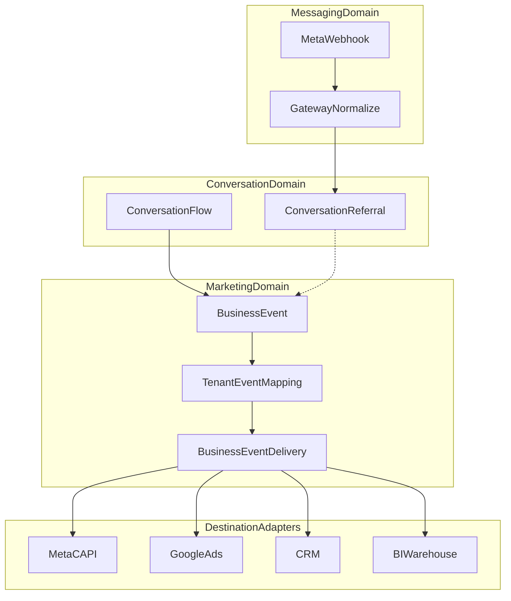

# ADR-0019: Marketing Domain and Attribution Events

## Status

Accepted — **Architecture Locked** (2026-08-02)

Significant changes to the Marketing Domain (e.g. new destination-adapter kinds beyond the Destination Adapter Contract, changes to the `BusinessEvent` model, or a different delivery mechanism) require a **new ADR or an explicit amendment**. Implementation may refine details; it must not reverse decisions in this document. Do not treat this ADR as an open living backlog.

**Conversation layer feature freeze:** `Conversation` / `ConversationReferral` (v1 slice) are stable foundations. Marketing and attribution features must be built in the Marketing Domain above them, not by expanding Conversation models, unless a new ADR explicitly authorizes that change. Bug fixes remain allowed.

## Date

2026-08-02

## Context

OmniMsg v1 is a CPaaS: messaging, WABA onboarding, and Meta Solution Partner operations (ADR-0018). Enterprise tenants will later need to measure business outcomes from conversations—especially Click-to-WhatsApp ads—and send conversion activity to Meta (Conversions API), then to Google Ads, CRM, analytics, and warehouses.

Coupling attribution to the WhatsApp messaging provider would lock the platform to one vendor and one channel. Requesting `whatsapp_business_manage_events` Advanced access before Conversion API is in product scope would slow App Review without delivering v1 messaging value.

A separate **Marketing Domain** that emits canonical business events, journals deliveries, and talks to destinations only through adapters keeps messaging clean and positions OmniMsg for a later Marketing & Attribution layer that competitors cannot copy by wrapping Cloud API alone.

## Decision

OmniMsg will introduce a **Marketing Domain** as a platform layer above Conversation, not inside `packages/providers/whatsapp` or any messaging adapter.

```text
Messaging Domain
    ↓
Conversation Domain
    ↓
Marketing Domain
    ↓
Destination Adapters
```

**Hard rule:** Marketing Domain emits canonical business events and has no compile-time dependency on destination providers. Orchestration selects adapters via registry / feature flags; Marketing Domain does not import Meta, Google, HubSpot, or other destination SDKs.

Phasing:

| Phase | Scope |
|-------|--------|
| **v1** | Messaging + SP; persist **ConversationReferral** (full referral + `ctwa_clid`) when inbound conversation path lands |
| **v1.x** | `BusinessEvent` + `BusinessEventDelivery`; Meta CAPI destination adapter; App Review `whatsapp_business_manage_events`; consent hooks; tenant dataset; feature flags |
| **v2** | Google Ads, TikTok, LinkedIn, HubSpot, Salesforce, GA4, BI export adapters |

Do **not** request Advanced access for `whatsapp_business_manage_events` until v1.x CAPI is in scope. v1 App Review focuses on messaging / management permissions (ADR-0018, Solution Partner runbook).

### Domain flow



### ConversationReferral (v1 — Conversation Domain)

Capture CTWA / ad referral on inbound without binding Marketing Domain to Meta field names as the sole schema.

Queryable fields: `source`, `source_id`, `headline`, `body`, `media_type`, `ctwa_clid`.  
Always store `raw_payload` (full provider referral object) so new Meta fields do not force an immediate migration.  
Tenant-scoped; tied to conversation / message refs.

Implementation is deferred to the inbound conversation slice; this ADR only locks the shape.

### BusinessEvent (v1.x — provider-agnostic)

```text
tenant_id
conversation_id          # optional when source != messaging
customer_id
source                    # WHATSAPP | INSTAGRAM | MESSENGER | WEB | EMAIL | API | CRM | BOOKING | SYSTEM
event_type                # canonical taxonomy (Appendix A)
event_version
schema_version
occurred_at
value
currency
metadata                  # free-form business payload
external_ids              # JSON map: meta_message_id, meta_wamid, campaign_id, adset_id, ad_id, dataset_id, ...
idempotency_key           # required; adapters must honor
correlation_id            # links Conversation → Lead → Appointment → Purchase
```

No Meta/Google/WhatsApp-specific columns on the event type. Destinations consume via mapping + adapters.

### Event mapping chain (v1.x)

```text
Internal event_type  →  Tenant display/alias  →  Destination event name
PurchaseCompleted    →  ReservationConfirmed  →  Meta Purchase
```

Per-tenant alias config; destination name mapping in the adapter / capability config—no per-client code branches.

### BusinessEventDelivery (v1.x — journal)

```text
event_id
destination
status          # Pending | Retry | Delivered | Failed | DeadLetter
error_class     # Appendix B
attempts
last_error
idempotency_key
```

Same retry / audit / idempotency pattern as messaging orchestration. Permanent failures → **DeadLetter**, not infinite retry.

### Destination Adapter Contract (v1.x)

Every destination adapter implements the same lifecycle:

```text
validate(event)      # schema / required fields / consent gates
transform(event)     # BusinessEvent → destination payload
send(payload)        # network call
interpret(response)  # → success | error_class + retry hint
supports(capability) # capability query
idempotency()        # how destination dedupe key is applied
```

Adding a provider = new contract implementation; **no** change to the `BusinessEvent` model.

### Destination capabilities (v1.x)

Separate from messaging channel capabilities (ADR-0008). Example flags: `supports_value`, `supports_currency`, `supports_deduplication`, `supports_offline_events`.

### ConsentState (design in this ADR; implement v1.x+)

```text
ads_tracking_allowed
analytics_allowed
marketing_allowed
consent_timestamp
consent_source
```

Adapters may send only when consent for that destination allows it.

### Data retention (defaults; align with ADR-0014)

| Entity | Default retain |
|--------|----------------|
| ConversationReferral | 24 months |
| BusinessEvent | 7 years |
| BusinessEventDelivery | 2 years |

Tenant overrides may follow later; defaults are recorded for GDPR anticipation.

### Dataset ownership (Meta CAPI — v1.x)

Dataset is **not** global:

```text
Tenant → Meta Business → Dataset → Events
```

Per-tenant (or per-WABA) `dataset_id` in tenant marketing config / `external_ids`.

### Multi-tenant security

`BusinessEvent` and `ConversationReferral` must never reference another tenant’s resources; adapters operate exclusively on the active tenant’s data.

### Feature flags (per-tenant rollout)

```text
MARKETING_EVENTS_ENABLED
META_CAPI_ENABLED
GOOGLE_ADS_ENABLED
```

(and later per destination).

### Capability matrix

| Module | v1 | v1.x | v2 |
|--------|----|------|-----|
| ConversationReferral | yes | yes | yes |
| BusinessEvent | no | yes | yes |
| BusinessEventDelivery | no | yes | yes |
| Event taxonomy / versioning / correlation / idempotency | design-only | yes | yes |
| ConsentState | design-only | yes | yes |
| Tenant + destination mapping | design-only | yes | yes |
| Meta CAPI + `whatsapp_business_manage_events` | no | yes | yes |
| Google Ads / TikTok / LinkedIn | no | no | yes |
| HubSpot / Salesforce / GA4 | no | no | yes |
| BI export (Snowflake / BigQuery) | no | no | yes |

### Out of Scope

This ADR does **not** make OmniMsg an Ads Manager. Explicitly out:

- Campaign management
- Audience creation
- Meta Ads / Google Ads account management
- Reporting dashboards
- BI warehouse implementation
- AI optimisation of campaigns

OmniMsg sends **canonical business outcomes** to destinations; it does not manage ad accounts or create audiences.

### Success Criteria

This ADR is considered **implemented** when:

- `ConversationReferral` exists and is persisted on CTWA / referral inbound
- `BusinessEvent` exists (taxonomy + versioning + idempotency + correlation)
- At least one destination adapter works end-to-end (expected: Meta CAPI)
- Retry + error classification + DeadLetter work
- Idempotency prevents duplicate sends
- A new provider can be added **without** changing the `BusinessEvent` model (Destination Adapter Contract only)

## Consequences

### Positive

- v1 stays focused on CPaaS; attribution is a deliberate v1.x+ layer.
- Provider-agnostic events + destination contract avoid Meta lock-in and repeated migrations.
- Referral `raw_payload`, taxonomy, versioning, consent, retention, and DLQ reduce future breaking changes.
- Clear Out of Scope and Success Criteria give a DoD for later engineering.

### Negative

- Marketing Domain adds another bounded context to design and operate.
- ConversationReferral in v1 requires inbound message persistence work that is not yet built.
- Meta CAPI and `whatsapp_business_manage_events` remain an App Review and ops dependency in v1.x.

### Neutral

- Documentation-only decision today; no contracts, migrations, or adapters in this change.
- First engineering follow-up when inbound conversations land: extract Meta `messages[].referral` → persist `ConversationReferral`.
- Messaging App Review proceeds without `whatsapp_business_manage_events` until v1.x.

## Appendix A — Canonical event taxonomy

```text
LeadCreated
LeadQualified
ConversationStarted
ConversationReplied
AppointmentScheduled
AppointmentCompleted
PurchaseStarted
PurchaseCompleted
SubscriptionStarted
SubscriptionRenewed
PaymentSucceeded
PaymentFailed
Custom
```

All destination adapters map from the same internal `event_type`. Use `Custom` + `metadata` for tenant-specific cases until promoted into the taxonomy.

## Appendix B — Error classification

| error_class | Typical action |
|-------------|----------------|
| ValidationError | DeadLetter immediately |
| AuthenticationError | Alarm; stop / DeadLetter until fixed |
| AuthorizationError | Alarm; DeadLetter |
| RateLimit | Retry + backoff / respect Retry-After |
| TemporaryFailure | Retry + exponential backoff |
| PermanentFailure | DeadLetter |
| ProviderBug | Alarm + DeadLetter (or limited retry per policy) |
| InternalError | Retry with limit; then DeadLetter + alarm |

`interpret(response)` on the destination adapter maps the vendor response to `error_class` and delivery status.
