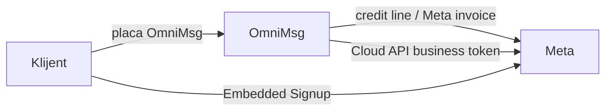

# Meta WhatsApp Solution Partner — ops runbook

Operational checklist for OmniMsg ([omnimsg.io](https://omnimsg.io), FinestAR) as a Meta WhatsApp **Solution Partner**. Product decision: [ADR-0018](../adr/ADR-0018-meta-whatsapp-solution-partner.md). Status and milestones: [North Star](../NORTH_STAR.md).

**Official docs:**

- [Get started for Solution Partners](https://developers.facebook.com/documentation/business-messaging/whatsapp/solution-providers/get-started-for-solution-partners)
- [Partners overview](https://developers.facebook.com/documentation/business-messaging/whatsapp/solution-providers/overview)

## Critical path risk

Solution Partner / Meta Business Partner approval (credit line, Direct Support) is an **external critical path**. You can build Cloud API, Embedded Signup, and webhooks on a **development app** in parallel. **Production onboarding with credit-line sharing waits on SP status.**

## Kickoff status (Trak A)

| Item | Status | Tracking |
|------|--------|----------|
| §1 MBP / Solution Partner application | **Blocked** (2026-07-20) — public MBP form: no eligible Business Manager; need WhatsApp SP / credit-line channel | Live tracker **outside this repo**: `/opt/stacks/ops/omnimsgio-meta-sp-kickoff.md` |
| §2 Development assets (portfolio, Business app, System User, test phone) | **In progress** — provision in parallel; fill IDs in the tracker | Same file |
| §3 `META_VERIFY_TOKEN` / `META_APP_SECRET` | Verify token prepared in local `.env`; App Secret still from Meta Dashboard | [.env.example](../../.env.example) |

Engineering does **not** block on SP approval. Update the out-of-repo tracker weekly until credit line is live.

**Operator links (kickoff):**

1. [Become a Meta Business Partner](https://www.facebook.com/business/marketing-partners/become-a-partner)
2. [Get started for Solution Partners](https://developers.facebook.com/documentation/business-messaging/whatsapp/solution-providers/get-started-for-solution-partners) — Prepare → Set up assets → Sign contracts → Build
3. [Meta Business Suite](https://business.facebook.com/) — portfolio, System Users, WABA
4. [Meta App Dashboard](https://developers.facebook.com/apps/) — create **Business** type app; App Secret; webhook verify token

## Ops checklist (Meta Business)

Follow this order.

### 1. Meta Business Partner / Solution Partner application

- Apply and track MBP / Solution Partner status (kickoff tracker §1).
- Credit line and Direct Support depend on approval — long-running; start early.
- Record application / case ID in `/opt/stacks/ops/omnimsgio-meta-sp-kickoff.md` (not in git).

### 2. Assets

Provision and keep admin access to (kickoff tracker §2 — **parallel with §1**):

| Asset | Notes |
|-------|--------|
| Business portfolio | Partner business; save Business ID |
| WABA | Partner test / ops WABA as needed |
| Meta App | Business type; **one app** for the platform; display name + contact email |
| Admin System User | For system token (credit line); generate token with WhatsApp permissions |
| Test Business Phone Number | Dev / smoke messaging; save `phone_number_id` |

### 3. Permissions + App Review (Advanced access)

Request Advanced access for:

- `whatsapp_business_management`
- `whatsapp_business_messaging`
- `whatsapp_business_manage_events` — **only** if Marketing Messages API + Conversions API are in scope

Complete App Review before production client traffic.

### 4. Terms of Service (WhatsApp Manager)

Partner accepts WhatsApp Business ToS in WhatsApp Manager. **Clients do not need to accept** under the Solution Partner model (per Meta SP docs).

### 5. Tokens

| Token | Role | Use |
|-------|------|-----|
| **System user token** | System User with **Finance editor** | Share / attach **credit line** to onboarded client WABAs |
| **Business access tokens** | From Embedded Signup code exchange | Cloud API send/receive and management on **client** WABAs |

Do not use the Finance-editor system token as the day-to-day messaging credential for client traffic.

### 6. Webhook and phone registration

1. Configure **one webhook callback URL** on the Meta app (OmniMsg: `apps/gateway` — verify challenge + app secret signature).
2. After Embedded Signup: **subscribe** the client WABA to the app webhook.
3. **Register** the business phone (PIN / 2FA). Meta expects registration within **14 days** after ES.

### 7. Credit line and client billing

1. Share / attach the partner **credit line** to each onboarded client WABA (system token + Finance editor).
2. Track `credit-line attached` per tenant in OmniMsg config.
3. **Internal client billing** (usage → invoices for WhatsApp + platform) is OmniMsg’s product — not a Meta feature. Reconcile invoiced usage against Meta credit-line cost in the billing phase.

## Onboarding flow (happy path)

1. Client completes Embedded Signup (or Hosted ES) via portal / API.
2. Exchange auth code → store **business access token**, WABA id, `phone_number_id`.
3. Subscribe WABA to webhook; register phone within 14 days.
4. Attach credit line; set tenant credit-line flag.
5. Messaging and delivery webhooks flow: Meta → gateway → events → worker / execution engine.

## Technical milestones (engineering backlog)

Not implemented in the foundation pivot — align with **api** / **channels** / **portal** / **billing** phases in North Star.

| Milestone | Component | Work |
|-----------|-----------|------|
| Webhook ingress | [`apps/gateway`](../../apps/gateway/omnimsg_gateway/main.py) | Meta verify + signature; single callback URL |
| Cloud API adapter | [`packages/providers/whatsapp`](../../packages/providers/whatsapp/) | Send/receive, register phone |
| Tenant WhatsApp config | DB / settings | WABA id, `phone_number_id`, business access token, credit-line attached flag |
| Embedded Signup | Portal / API | ES (or Hosted ES); code → business token; optional partner-initiated WABA |
| Client billing | Billing (v1+) | Usage → client invoices; reconcile with Meta credit-line cost |

## Related

- [ADR-0018](../adr/ADR-0018-meta-whatsapp-solution-partner.md)
- [ADR-0017](../adr/ADR-0017-meta-whatsapp-tech-provider.md) (superseded)
- [North Star — SP milestones](../NORTH_STAR.md#solution-partner-technical-milestones)
